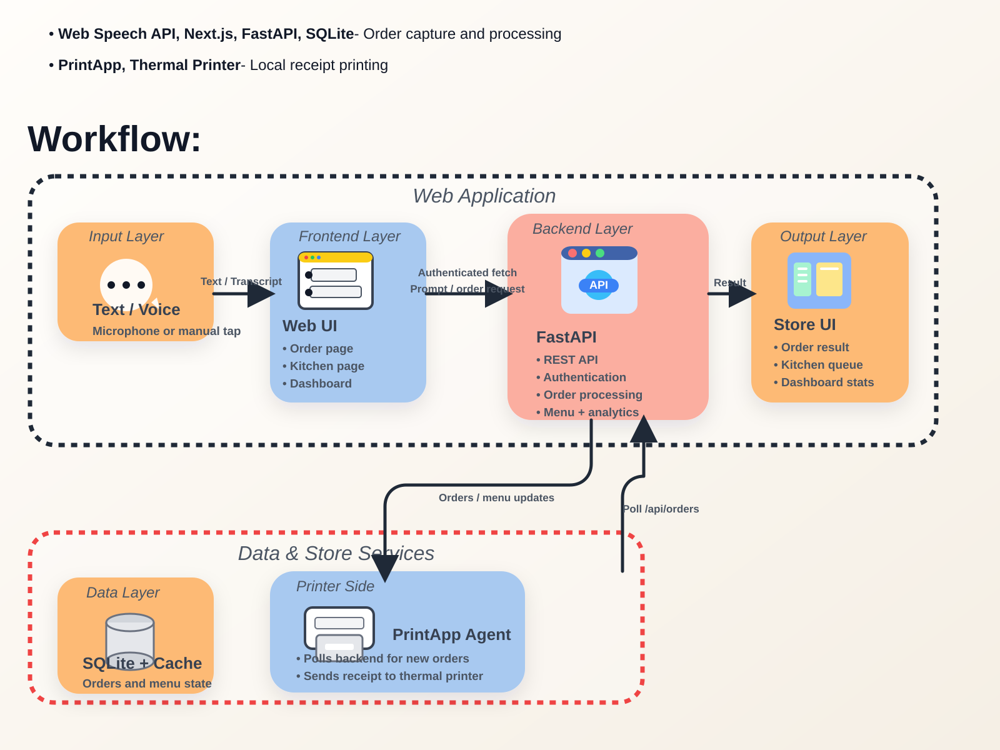

# EatEasy Workflow

ไฟล์ภาพสรุปแบบคร่าวๆในมุมมอง `Input -> Frontend -> Backend -> Data -> Output` อิงจากโค้ดปัจจุบันของ `frontend/`, `backend/` และ `printapp/`

Assets:

- SVG: [docs/assets/workflow-overview.svg](./assets/workflow-overview.svg)
- PNG: [docs/assets/workflow-overview.png](./assets/workflow-overview.png)

สรุปสั้นๆ:

- `frontend/src/app/page.tsx` เป็นหน้ารับออเดอร์หลัก ใช้ Web Speech API และ manual add
- `backend/main.py` เป็นศูนย์กลางของ auth, order processing, menu, orders, analytics และ SQLite โดย expose API ใต้ `/api/*`
- `frontend/src/app/kitchen/page.tsx` poll คิวที่ยัง `pending`
- `frontend/src/app/dashboard/page.tsx` ใช้ข้อมูลเมนู ออเดอร์ และ analytics
- `printapp/printer_core.py` เป็น local agent ที่ login เข้า base URL ที่ตั้งค่าไว้ แล้วดึง `/api/orders` ไปพิมพ์
